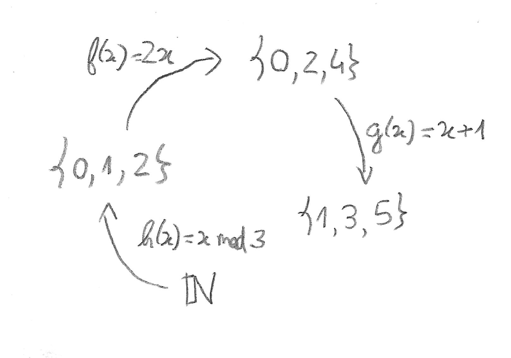

### (Yet Another)
## Introduction to
## Category Theory

Rui Gonçalves <!-- .element: style="margin-top: 80px" -->

ShiftForward

June 20, 2017

Note:

- Not a presentation to help being a better programmer (at least directly)
- Will miss some very important things in CT
- Will sacrifice formal correctness for ease of understanding
- Focus on abstract data types and how patterns are derived
- Next talk can go deeper on type classes


---


## A Category


Note:

- result of abstracting many similar math structs


---


## A Category


---


## A Category


---


## It's all about composition


Note:

- Looks totally like functions, but try to abstract from it
- An abstraction layer: define behavior without knowing the specific implementation
- The equality of arrows is different for different categories: apart from the laws of categories, we can't compare them


---


## **Set** Category




---


## **Set** Category

- $id(x) = x$
- $(g∘f)(x) = g(f(x))$


---


## **Hask** Category


Note:

- Explain why Haskell instead of Scala
- Warn about the existence of a bottom instance


---


## **Hask** Category

```haskell
id :: a -> a
id x = x

compose :: (b -> c) -> (a -> b) -> (a -> c)
compose g f x = g (f x)
-- compose g f = g . f
-- compose = (.)
```

Note:

- Try to abstract about the meaning of the objects and arrows
- Objects and arrows are black boxes


---


## More Categories

- No objects (**0**)
- Single object (**1**)
- Orders
- Vector spaces (**Vect**)
- ...


---


## Universal Constructions

- Patterns of relationships between objects
- Allows reusing laws from one category in others
- A balance of precision and recall
  1. pick a pattern and look for all its occurences
  2. rank the hits and pick the best fit

Note:

- "There is a common construction in category theory called the universal construction for defining objects in terms of their relationships. One way of doing this is to pick a pattern, a particular shape constructed from objects and morphisms, and look for all its occurrences in the category. If it’s a common enough pattern, and the category is large, chances are you’ll have lots and lots of hits. The trick is to establish some kind of ranking among those hits, and pick what could be considered the best fit."


---


## Initial Object


Note:

- An object with arrows for every other object
- No guarantee that such an object exists (ok), there can be too much
- Restrict to a unique arrow
- Now unique up to isomorphism (explain later)


---


## Initial Object

- The object is called $0$
- The unique arrow $0 \rightarrow A$ is called $0_A$
- The empty set is an initial object in **Set**
- Any empty type (such as `Void`) is an initial object in **Hask**


---


## Terminal Object


---


## Terminal Object


- The object is called $1$
- The unique arrow $A \rightarrow 1$ is called $1_A$
- Any singleton set is a terminal object in **Set**
- Any type with a single instance (such as `()`) is a terminal object in **Hask**

Note:

- Rules are kept the same


---


## Duality

- **C<sup>op</sup>** is a category obtained by keeping all objects and reversing the arrows of category **C**
- Automatically a category:
  - $id^{op} = id$
  - If $h = g∘f$, then $h^{op} = f^{op}∘g^{op}$

Note:

- "doubles the productivity of every mathematician working in category theory"


---


## Duality

- Constructions in the opposite category are prefixed with "co" – coproducts, comonads, colimits...
- **C<sup>op</sup>** may be equal to **C** (not in **Set** and **Hask**)
- The terminal object is an initial object in the opposite category!


---


## Isomorphism

- In universal constructions, the "shape" is the key
- It's enough to have a one-to-one mapping between objects
- In category theory, such a mapping is a pair of arrows, one being the _inverse_ of the other


---


## Isomorphism


---


## Isomorphism

- $f: A \rightarrow B$ is an isomorphism iff there is an arrow $f^{-1}: B \rightarrow A$ such that:
  - $f^{-1}∘f = id_A$
  - $f∘f^{-1} = id_B$


---


## Isomorphism

- Two initial objects must be isomorphic:
  - Let $0^A$ and $0^B$ be two initial objects with arrows $0^A_C: 0^A \rightarrow C$ and $0^B_C: 0^B \rightarrow C$ for every $C$
  - $0^A_{0B} ∘ 0^B_0A$ is an arrow $0^A \rightarrow 0^A$ <!-- .element: class="fragment" -->
  - But there can be only one arrow from $0^A$ to any other object, and we already have $id_A$! <!-- .element: class="fragment" -->
- No need to show the same thing for the terminal object! <!-- .element: class="fragment" -->

---


## Isomorphism


---


## Products

- Goal: generalize the notion of a cartesian product of sets
- First idea:
  - three objects: $A \times B$ is the product object of $A$ and $B$
  - two arrows, $outl: A \times B \rightarrow A$ and $outr: A \times B \rightarrow B$, extracting the first and the second component


---


## Products


---


## Products

```haskell
outl :: (Int, Bool) -> Int
outl (x, b) = x

outr :: (Int, Bool) -> Bool
outr (x, b) = b
```


---


## Products

```haskell
outl :: Int -> Int
outl x = x

outr :: Int -> Bool
outr _ = True
```


---


## Products

```haskell
outl :: (Int, Int, Bool) -> Int
outl (x, _, _) = x

outr :: (Int, Int, Bool) -> Bool
outr (_, _, b) = b
```


---


## Products

- Need to rank candidates
- Idea: find an arrow between candidates that reconstructs one in function of the other
- Let $P$ and $Q$ be two candidates for a product with arrows $outl_P$, $outr_P$, $outl_Q$ and $outl_Q$:
  - $P$ is "better" than $Q$ iff there exists an **unique** arrow $m: Q \rightarrow P$ such that $outl_Q = outl_P∘m$ and $outr_Q = outr_P∘m$
  - Similiar to factorization in mathematics

Note:

- "We would like to say that c is “better” than c’ if there is a morphism m from c’ to c — but that’s too weak. We also want its projections to be “better,” or “more universal,” than the projections of c’. What it means is that the projections p’ and q’ can be reconstructed from p and q using m."


---


## Products

- Is `(Int, Bool)` better than `Int`?

```haskell
m :: Int -> (Int, Bool)
m x = (x, True)
```

- Is `Int` better than `(Int, Bool)`?

```haskell
m :: (Int, Bool) -> Int
-- m (x, b) = ???
```

Note:

- `Int` conveys too little information


---


## Products

- Is `(Int, Bool)` better than `(Int, Int, Bool)`?

```haskell
m :: (Int, Int, Bool) -> (Int, Bool)
m (x, _, b) = (x, b)
```

- Is `(Int, Int, Bool)` better than `(Int, Bool)`?

```haskell
m :: (Int, Bool) -> (Int, Int, Bool)
-- m (x, b) = (x, ???, b)
```

Note:

- There is not an unique way to factorize `(Int, Int, Bool)`


---


## Products

- With the factorization condition, every time a product exists it is unique up to a unique isomorphism
- `(a, b)` is the best match in **Hask** – A _factorizer_ can show it:

```haskell
factorizer :: (c -> a) -> (c -> b) -> (c -> (a, b))
factorizer outl outr = \x -> (outl x, outr x)
-- factorizer outl outr x = (outl x, outr x)
```


---


## Coproducts


---


## Coproducts

- By duality, when it exists, a coproduct is unique up to unique isomorphism
- `Either a b` is the best match in **Hask**:

```haskell
-- Either a b = Left a | Right b

factorizer :: (a -> c) -> (b -> c) -> (Either a b -> c)
factorizer inl inr (Left a) = inl a
factorizer inl inr (Right b) = inr b
```


---


## Algebra of Data Types

- Most data structures in programming are built using products and coproducts
- Many properties are composable: equality, comparison, conversions...
- Treating data structures by their shape paves the way for automatic derivation


---


## Algebra of Data Types

- These types are isomorphic in **Hask**:

```haskell
(String, Int, Bool)       -- String * Int * Bool

((String, Int), Bool)     -- (String * Int) * Bool

(String, (Int, Bool))     -- String * (Int * Bool)

data Contact = Contact {  -- String * Int * Bool
  name :: String,
  age :: Int,
  gender :: Bool
}

(Int, Bool, String)       -- Int * Bool * String

(Int, Bool, String, ())   -- Int * Bool * String * 1
```


---


## Algebra of Data Types

- These types are isomorphic in **Hask**:

```haskell
Either (Either String Int) Bool     -- (String + Int) + Bool

Either String (Either Int Bool)     -- String + (Int + Bool)

data JsValue =                      -- String + Int + Bool
  JsString String |
  JsNumber Int |
  JsBoolean Bool

Either (Either Int Bool) String     -- (Int + Bool) + String

data JsValue2 =                     -- String + Int + Bool + 0
  JsString String | JsNumber Int |
  JsBoolean Bool | Void
```


---


## Algebra of Data Types

- **Set** and **Hask** are monoidal categories:
  - With the product as binary operation and the terminal object as unit
  - With the coproduct as binary operation and the initial object as unit
- It can be shown that every category that _has_ products and a terminal object is also a monoidal category (and the dual proposition for coproducts)


---


## Algebra of Data Types

- These types are isomorphic in **Hask**:

```haskell
-- String * (Int + Bool)
(String, Either Int Bool)

-- (String * Int) + (String * Bool)
Either (String, Int) (String, Bool)
```


---


## Algebra of Data Types

- These types are isomorphic in **Hask**:

```haskell
-- String * 0
(String, Void)

-- 0
Void
```


---


## Algebra of Data Types

- **Set** and **Hask** form a _semiring_ under the product and coproduct
- Not every category with product and coproduct monoids is a semiring


---


## Algebra of Data Types

| Numbers      | Types
|--------------|--------
| $0$          | `Void`
| $1$          | `()`
| $a + b$      | <code>Either a b = Left a &#124; Right b</code>
| $a \times b$ | `(a, b)` or `Pair a b = Pair a b`
| $2 = 1 + 1$  | <code>data Bool = True &#124; False</code>
| $1 + a$      | <code>data Maybe = Nothing &#124; Just a</code>


---


## Algebra of Data Types

- Other mathematical concepts with meaning in type theory: exponentials, infinite sums, derivatives


---


## What's More?

- Functors
- Natural transformations
- Function objects
- Everything else :)


---


Thank you! <!-- .element: style="text-align: left" -->

- https://bartoszmilewski.com/2014/10/28/category-theory-for-programmers-the-preface

- _Algebra of Programming_, Richard Bird and Oege de Moor (1997)
